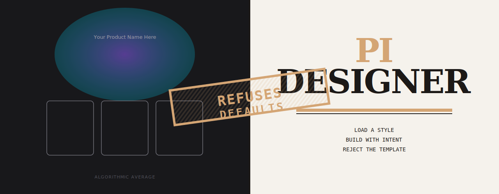

<p align="center">
  
</p>

# pi-designer

A native Pi design engineering extension. Always-on design rules, 380 deferred skills, a visual design deck, and 13 Pi API integrations — all in a feature-sliced architecture.

## Install

```bash
pi install npm:pi-designer
```

Local checkout:

```bash
pi -e ./app/pi-extension.ts
```

## What it does

**Every turn** (zero opt-in needed):

- Design rules injected into the system prompt (~450 tokens) — shadows, radius, contrast, animation, spacing, anti-AI-defaults
- Session vibe restored from disk + session entries
- Status widget shows design mode, vibe, and skill count
- Footer shows `DESIGN: ON`

**When the model calls `designer()`** (on demand):

- Loads any of **380 skills** — 9 curated, 47 reference, 324 style
- Styles include cyberpunk, solarpunk, brutalist, art-deco, wabi-sabi, glassmorphic, neumorphic, pixel-art, and 316 more

**When the model calls `design_deck()`** (on demand):

- Opens a live browser deck with multi-slide options
- Code blocks with Prism.js syntax highlighting
- Mermaid.js diagrams
- Raw HTML previews in sandboxed iframes
- Image previews from disk
- SSE streaming for generate-more loops
- Model selector, thinking level, light/dark/auto theme
- Keyboard navigation, ARIA radiogroup
- Save/load/export snapshots

**After each turn** (automatic):

- Scans modified `.css`/`.tsx`/`.jsx`/`.html` files for AI-default patterns
- Runs `fix-ai-slop.mjs` validator via `pi.exec()`
- Reports findings as a warning notification

## Commands

```text
/designer         Toggle design mode on/off (or Ctrl+D)
/designer-vibe    Set persistent project preferences
/designer-doctor  Health check for skills and state
```

## CLI flags

```bash
pi --design-style cyberpunk "Build a landing page"
pi --design-style solarpunk -e ./app/pi-extension.ts
```

## Environment overrides

```bash
PI_DESIGNER_MODE=1   # force on
PI_DESIGNER_MODE=0   # force off
```

## Skills catalog (380 total)

### Curated (9)

| Skill | Role |
|---|---|
| `designer-master` | Core workflow and art direction |
| `design-md` | Visual-system contract |
| `expression` | Ambition and signature-moment toolkit |
| `animate` | Purposeful motion guidance |
| `review-skill` | Delivery review |
| `design-laws` | UX psychology + aesthetic principles |
| `ui-polish` | Shadows, borders, spacing, rendering |
| `motion-craft` | Animation engineering, springs, reduced-motion |
| `visual-system` | Token architecture, color theory, type pairing |

### Reference (47)

Emil Kowalski design engineering, Apple fluid interfaces, OKLCH color space, typography cheat sheets, skeuomorphic UI recipes, animation vocabulary, content systems, and more.

### Style (324)

Cyberpunk, solarpunk, brutalist, art-deco, wabi-sabi, glassmorphic, neumorphic, bento-grid, cottagecore, vaporwave, dark-academia, pixel-art, retro-futurism, and 311 more.

## Pi API integrations (13)

| API | Feature | Effect |
|---|---|---|
| `registerCommand` | 3 commands | `/designer`, `/designer-vibe`, `/designer-doctor` |
| `registerTool` | 2 tools | `designer()` + `design_deck()` |
| `registerShortcut` | Ctrl+D / Ctrl+Shift+D | Toggle mode / quick-load skills |
| `registerFlag` | `--design-style` | Pre-load a style on startup |
| `registerMessageRenderer` | TUI rendering | Custom render for designer results |
| `on("before_agent_start")` | Design rules | Injects ~450 tokens of rules every turn |
| `on("session_start")` | Vibe restore | Restores preferences from session entries |
| `on("turn_end")` | Design audit | Scans UI files for AI-default patterns |
| `on("turn_end")` | Exec validator | Runs `fix-ai-slop.mjs` via `pi.exec()` |
| `on("agent_end")` | Status update | Refreshes widget + footer |
| `on("agent_start")` | Session naming | Auto-names "Design: [style]" |
| `on("tool_execution_end")` | Tool detection | Names session when designer() called |
| `appendEntry` | Session persistence | Vibe survives restarts and compaction |

## Architecture (FSD)

```text
app/pi-extension.ts                     composition root (34 lines)
entities/designer-skill/                  domain model
features/
  design-rules/                         before_agent_start — always-on rules
  designer-tool/                        designer() — deferred skill loading
  designer-deck/                        design_deck() — visual presentation server
  designer-resources/                   380-skill catalog
  designer-status/                      setWidget + setStatus — live panel
  designer-shortcuts/                   Ctrl+D / Ctrl+Shift+D
  designer-session/                     session_start — vibe restore
  designer-flags/                       --design-style CLI flag
  designer-naming/                      setSessionName — auto naming
  designer-renderer/                    registerMessageRenderer — TUI
  design-audit/                         turn_end — AI-default pattern scan
  design-validator/                     turn_end — exec-based validator
  vibe-preferences/                     /designer-vibe + persistence
  designer-doctor/                      /designer-doctor health report
  mode-activation/                      /designer + PI_DESIGNER_MODE
  plan-validation/                      pure plan checks
shared/
  design-rules.ts                       compact rules text (~1.8KB)
  package-paths.ts                       resource paths
skills/                                  380 design skill files
```

```text
app -> features -> entities
 |       |
 └──────> shared

Lateral feature imports: 0
Dependency direction: enforced by check-release.mjs
```

## Context cost

```text
Always-on design rules:   ~450 tokens
Tool snippets:            ~125 tokens
TOTAL per turn:           ~575 tokens
Skills at startup:        0 (380 deferred)
```

## Verification

```bash
npm test              # 103+ tests, 0 failures
npm run check:release # FSD + secrets + file integrity
npm run e2e:smoke     # 11 hook + tool + shortcut checks
```

## License

MIT
